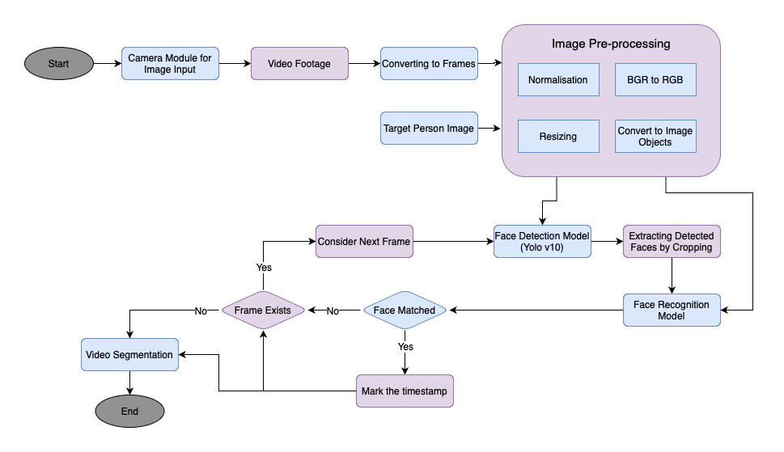
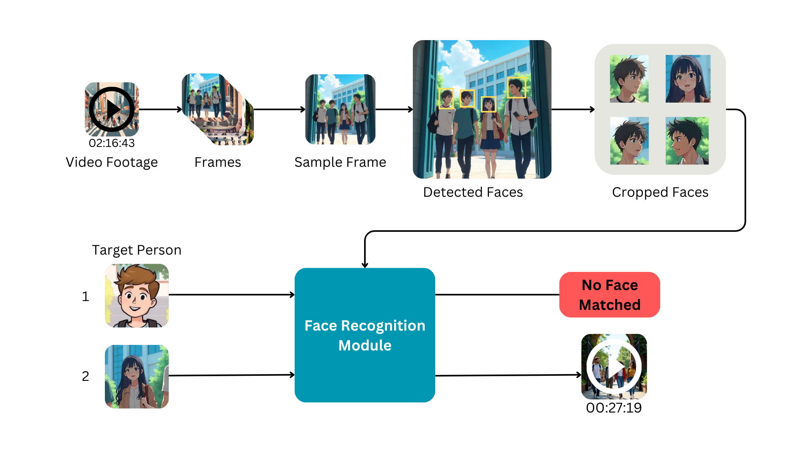
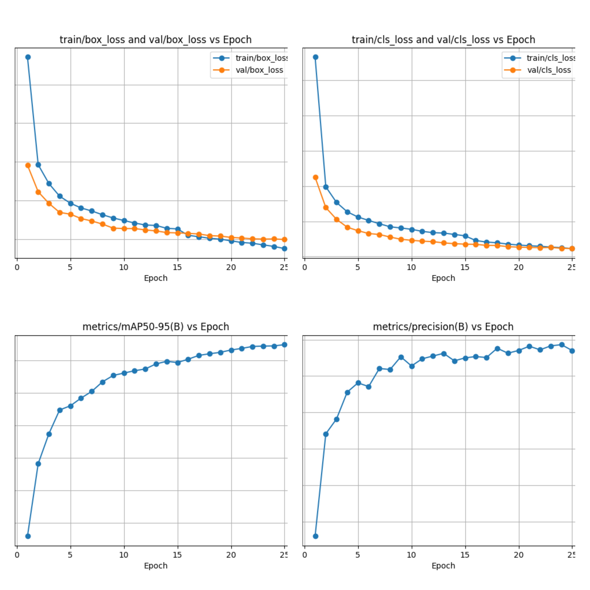

# Vision Matrix: Image-Driven Video Segmentation for Surveillance

## Project Overview
This project leverages **YOLOv10** and **OpenCV** for efficient face detection, recognition, and video segmentation. The system identifies specific individuals in video footage based on an uploaded reference image and segments relevant clips for streamlined surveillance and analysis. Designed for real-time processing, it offers a powerful solution for law enforcement and public safety.

## Key Features
- **Real-Time Detection and Segmentation**: Fast and accurate face detection using YOLOv10.
- **Image-Driven Person Recognition**: Matches faces in video frames with a provided image for targeted analysis.
- **Automated Video Clipping**: Outputs segmented videos focusing only on frames containing the identified person.
- **User-Friendly Interface**: Built with Streamlit for easy interaction.

---

## System Architecture
The system integrates:
1. **YOLOv10** for face detection.
2. **OpenCV** for frame extraction, face recognition, and video processing.
3. **Streamlit** for user interface and interaction.



---

## Workflow
1. **Input**: Users upload a video file and a reference face image.
2. **Processing**:
   - YOLOv10 detects faces in video frames.
   - OpenCV compares detected faces with the reference image.
   - Frames with matches are clipped and compiled into a new video.
3. **Output**: A downloadable video containing only the relevant segments.



---

## Installation

### Prerequisites
- Python 3.8+
- GPU with CUDA support for optimal performance.
- Libraries: OpenCV, Streamlit, face_recognition.

### Steps
1. Clone the repository:
   ```bash
   git clone https://github.com/aniketdhage1508/Image-Driven-Video-Segmentation.git
   cd Image-Driven-Video-Segmentation
   ```
2. Install dependencies:
   ```bash
   pip install -r requirements.txt
   ```
3. Run the application:
   ```bash
   streamlit run app.py
   ```

---

## Demo
### Input
Upload:
- **A video file** (e.g., `.mp4`, `.avi`).
- **A person image** (e.g., `.jpg`, `.png`).

### **Eg.**
- **[Input Image](input_image.jpg)**
- **[Input Video](input_video.mp4)**

### Output
Download the processed video with highlighted segments.
- #**[Output Video](output_video.mp4)**

---

## Results
### Training Curves


---

## Technologies Used
- **YOLOv10**: High-performance face detection.
- **OpenCV**: Frame processing and face recognition.
- **Streamlit**: Interactive web interface.

---

## Future Scope
- **Enhanced Detection**: Improve handling of occluded or low-quality faces.
- **Real-Time Processing**: Integrate GPU acceleration for faster frame analysis.
- **Advanced Features**: Add multi-face detection and tracking.

---

## Contribution
Contributions are welcome! Please submit a pull request or open an issue for discussion.

---

## License
This project is licensed under the [MIT License](LICENSE).

---
